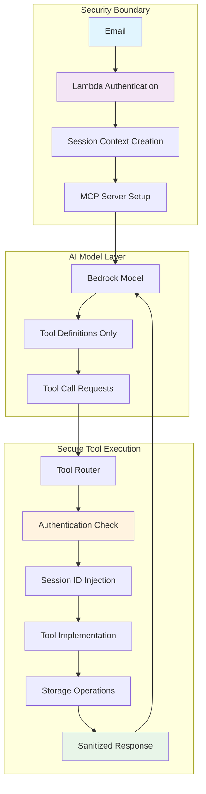
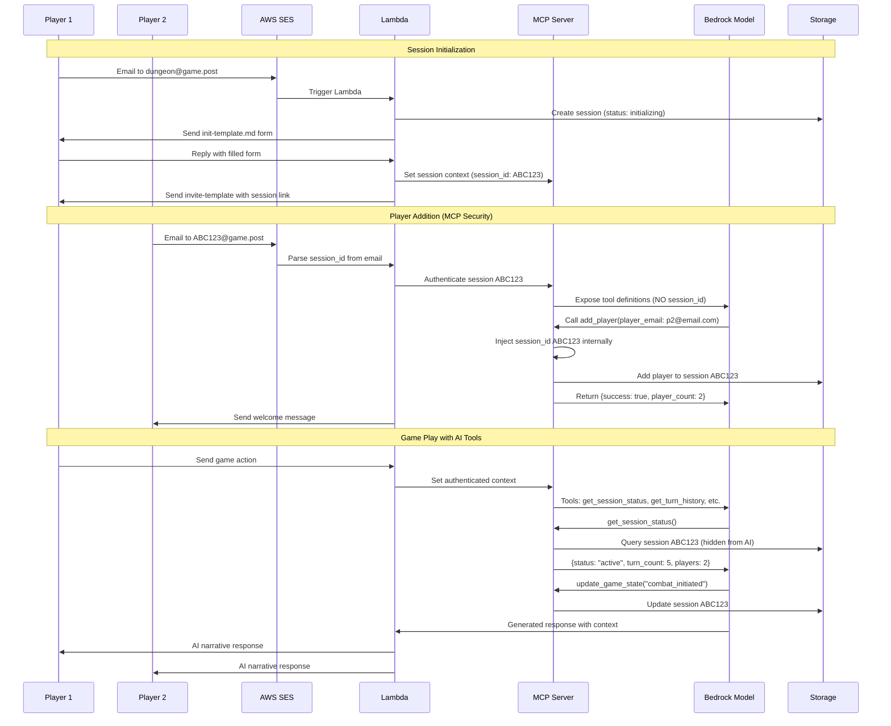

# GPTTherapy

**Email-driven turn-based AI therapy and storytelling system**

A serverless, email-only, asynchronous communication system mediated by AI agents (narrators). It enables interactive storytelling or guided therapeutic dialogue via email, turn by turn.

[](https://www.python.org/downloads/)
[](https://aws.amazon.com/lambda/)
[](https://github.com/astral-sh/ruff)

## 🎯 Overview

GPTTherapy supports two primary use cases:

- **🧙‍♂️ Narrative Role-Playing Games** (e.g., `dungeon@dungeon.post`)
- **🫂 Couples or Group Therapy** (e.g., `intimacy@intimacy.post`)

### Key Features

- **Turn-based system**: Sessions advance only after all required participants respond
- **Email interface only**: No frontend; all interactions via standard email clients
- **AI-mediated narratives**: LLM agents process player input and generate cohesive responses
- **MCP tool security**: Secure AI model access with session ID isolation and state validation
- **Session memory & persistence**: Complete game state tracking with DynamoDB and S3
- **Automatic timeout handling**: Smart reminders and session management
- **Robust email processing**: Advanced parsing with Pydantic validation
- **Comprehensive monitoring**: Metrics, health checks, and observability
- **Infrastructure as Code**: Complete AWS deployment with Terraform/OpenTofu

## 🏗️ Architecture

### High-Level System Flow

```
┌─────────────────┐    ┌──────────────────┐    ┌─────────────────┐
│   Email Client  │───▶│  AWS SES/Lambda  │───▶│   Game Engine   │
│   (Any client)  │    │  (Email Parser)  │    │ (Turn Manager)  │
└─────────────────┘    └──────────────────┘    └─────────────────┘
                                │                        │
                                ▼                        ▼
                       ┌──────────────────┐    ┌─────────────────┐
                       │   Email Models   │    │  State Machine  │
                       │ (Pydantic Validation)│    │  (Session/Turn) │
                       └──────────────────┘    └─────────────────┘
                                │                        │
                                ▼                        ▼
                       ┌──────────────────┐    ┌─────────────────┐
                       │    Storage       │    │   AI Agent      │
                       │ (DynamoDB + S3)  │    │  (Bedrock MCP)  │
                       └──────────────────┘    └─────────────────┘
```

### MCP Tool Security Architecture

GPTTherapy implements a sophisticated **Model Context Protocol (MCP)** integration that allows AI models to access session management tools while maintaining strict security isolation:



#### Key Security Principles

1. **Session ID Isolation**: Models NEVER see or specify session IDs
2. **Pre-authenticated Context**: Lambda sets session context before model interaction
3. **Tool Parameter Validation**: Models can only provide allowed parameters
4. **Response Sanitization**: All responses strip session identifiers
5. **State-based Authorization**: Tools validate session state before execution

### Technology Stack

- **Python 3.12+**: Core language with modern typing
- **AWS Serverless**: Lambda, SES, DynamoDB, S3, EventBridge
- **FastMCP**: Model Context Protocol for secure AI tool calling
- **Pydantic**: Data validation and serialization
- **Whenever**: Modern datetime handling
- **Email-validator**: Robust email address validation
- **Transitions**: State machine management
- **Boto3**: AWS SDK
- **OpenTofu/Terraform**: Infrastructure as Code

## 🚀 Quick Start

### Prerequisites

- Python 3.12+
- AWS CLI configured
- OpenTofu or Terraform installed
- Domain configured for email reception

### Installation

```bash
# Clone the repository
git clone https://github.com/promptexecution/gpttherapy.git
cd gpttherapy

# Setup development environment (recommended)
just complete-setup

# Or step by step:
just setup                 # Install dependencies and pre-commit hooks
just tf-deploy             # Deploy AWS infrastructure
just setup-github-secrets  # Configure GitHub Actions secrets
```

### Development Commands

All project commands are managed through the `justfile` for consistency and DRY principles. Run `just` to see all available commands.

```bash
# Development workflow
just test                  # Run all tests
just lint                  # Check code quality
just fix                   # Fix linting issues
just pre-commit            # Run pre-commit hooks

# Deployment and monitoring
just tf-deploy             # Deploy infrastructure
just logs                  # View Lambda function logs
just status                # Show project and tool status

# Admin CLI operations
just admin-sessions        # List all active sessions
just admin-session <ID>    # Show session details
just admin-logs            # Tail recent logs (supports --filter and --lines)
just admin-logs-dump       # Dump logs for analysis
just admin-envrc           # Generate .envrc from terraform state

# Database migrations
cd context_portal && alembic upgrade head
```

## 📁 Project Structure

```
gpttherapy/
├── src/                           # Core application code
│   ├── ai_agent.py               # AI agent integration (Bedrock)
│   ├── bedrock_mcp_integration.py # MCP tool calling with Bedrock
│   ├── mcp_tools.py              # Secure MCP server and tools
│   ├── datetime_utils.py         # Centralized datetime handling
│   ├── email_models.py           # Pydantic email validation models
│   ├── email_parser.py           # Email parsing and processing
│   ├── error_handler.py          # Structured error handling
│   ├── game_engine.py            # Turn-based game logic
│   ├── game_state.py             # Game state persistence
│   ├── lambda_function.py        # AWS Lambda entry point
│   ├── logging_config.py         # Structured logging setup
│   ├── monitoring.py             # Metrics and health monitoring
│   ├── settings.py               # Configuration management
│   ├── state_machines.py         # Session/turn state machines
│   ├── storage.py                # DynamoDB and S3 abstraction
│   └── timeout_processor.py      # Timeout and reminder handling
├── admin_cli.py                   # Admin CLI/TUI tool (b00t Python patterns)
├── tests/                         # Comprehensive test suite
├── terraform/                     # Infrastructure as Code
│   ├── backend.tf                # AWS provider and backend
│   ├── gpttherapy-lambda.tf      # Lambda function infrastructure
│   └── github-secrets.tf         # CI/CD secrets management
├── games/                         # Game configurations (to be created)
│   ├── dungeon/                  # RPG adventure configurations
│   └── intimacy/                 # Therapy session configurations
├── context_portal/               # Database and context management
├── .github/workflows/            # CI/CD pipeline
├── justfile                      # Task runner with common commands
└── pyproject.toml               # Project configuration
```

## 🎮 How It Works

### Player Interaction Flow



### User Flow

1. **Session Creation**: User emails `dungeon@game.post`
2. **Form Response**: Receives `init-template.md` form, fills it out, replies
3. **Player Invitation**: Receives `invite-template.md` with session-specific email address
4. **Secure Player Addition**: New players use MCP `add_player()` tool (only during initialization)
5. **Game Progression**: AI uses MCP tools to maintain game state and generate contextual responses
6. **Turn Management**: Automatic state transitions and timeout handling

### Email Addressing & Security

Sessions use encoded email addresses for secure routing:
- `ABC123@dungeon.promptexecution.com` → Session ID: `ABC123`
- **Security**: Session ID extracted by Lambda, NEVER exposed to AI model
- **Routing**: AI responses come from domain-specific addresses
- **Recovery**: Automatic bounce handling and error recovery

### MCP Tool Security Model

#### Tool Definitions Exposed to Model
```python
# What the AI model sees (NO session information)
{
    "name": "add_player",
    "description": "Add a new player to the session (only during initialization)",
    "parameters": {
        "type": "object",
        "properties": {
            "player_email": {"type": "string"}
        },
        "required": ["player_email"]
    }
}
```

#### Secure Tool Execution Flow
```python
# 1. Model makes tool call (session-agnostic)
model_request = {
    "tool_name": "add_player",
    "parameters": {"player_email": "newplayer@example.com"}
}

# 2. Lambda injects authenticated session context
authenticated_context = SessionSecurityContext(
    session_id="ABC123",  # From email parsing, NOT from model
    player_email="admin@example.com",
    game_type="dungeon"
)

# 3. Tool execution with session access
async def add_player_secure(player_email: str):
    ctx = ensure_authenticated()  # Gets session_id: ABC123

    # Check if session allows new players
    session = storage.get_session(ctx.session_id)  # Uses ABC123
    if session.status not in ["initializing", "waiting_for_players"]:
        return {"error": "Cannot add players after game has started"}

    # Add player to authenticated session
    session.players.append(player_email)
    storage.update_session(ctx.session_id, session)

    # Return sanitized response (NO session_id)
    return {
        "success": True,
        "player_email": player_email,
        "player_count": len(session.players)
    }
```

#### Available MCP Tools

| Tool | Purpose | Model Access | Session State Required |
|------|---------|--------------|----------------------|
| `get_session_status` | Current game state | ✅ Safe metadata only | Any |
| `get_turn_history` | Recent player actions | ✅ Sanitized history | Any |
| `add_player` | Add new player | ✅ Email parameter only | `initializing`, `waiting_for_players` |
| `check_player_status` | Player information | ✅ Public player data | Any |
| `update_game_state` | Progress narrative | ✅ State description | `active` |
| `get_game_rules` | Game configuration | ✅ Rules content | Any |

### State Management

The system uses sophisticated state machines for:
- **Session States**: `initializing` → `waiting_for_players` → `active` → `completed`
- **Turn States**: `waiting` → `processing` → `completed`
- **Tool Authorization**: State-based access control (e.g., `add_player` only during initialization)
- **Automatic Transitions**: Based on player responses and timeouts

## 🔧 Core Features

### Advanced Email Processing

- **Pydantic Validation**: Automatic email validation with structured error handling
- **Content Extraction**: Intelligent parsing of player actions and responses
- **Spam Detection**: Built-in spam scoring and filtering
- **Attachment Support**: File attachment handling for game assets
- **Email Threading**: Proper reply chain management

### Robust DateTime Handling

- **Whenever Library**: Modern, timezone-aware datetime operations
- **Consistent Timestamps**: Centralized timestamp management across all modules
- **Timezone Safety**: Automatic UTC handling with proper conversions
- **Duration Formatting**: Human-readable time calculations

### Game Engine

- **Multiplayer Coordination**: Turn-based system supporting 2-8 players
- **Flexible Game Types**: Support for both RPG adventures and therapy sessions
- **State Persistence**: Complete game state tracking in S3
- **Timeout Management**: Automatic handling of non-responsive players

### AI Integration

- **AWS Bedrock**: Integration with Claude and other LLM models
- **Context Management**: Maintains session context across turns
- **Template System**: Configurable agent personalities and responses
- **Content Safety**: Built-in content filtering and safety checks

### Monitoring & Observability

- **Structured Logging**: JSON logging with context preservation
- **Metrics Collection**: Custom CloudWatch metrics
- **Health Monitoring**: Automated system health checks
- **Error Tracking**: Comprehensive error handling with recovery

## 🧪 Testing

The project includes comprehensive testing with 97%+ test coverage:

```bash
# Run all tests
just test

# Run specific test modules
python -m pytest tests/test_email_parser.py -v
python -m pytest tests/test_game_engine.py -v
python -m pytest tests/test_datetime_utils.py -v

# Run with coverage
python -m pytest --cov=src tests/
```

### Test Coverage

- **263 total tests** across all modules with 97%+ coverage
- **Email Processing**: 32 tests covering Pydantic validation, parsing, and content extraction
- **Game Engine**: 24 tests for turn management and multiplayer coordination
- **State Machines**: 27 tests for session and turn state transitions
- **DateTime Utilities**: 30 tests for timezone handling and timestamp operations
- **Storage Layer**: 20 tests for DynamoDB and S3 operations
- **Monitoring**: 30 tests for metrics and health checks
- **MCP Security**: 20 tests for tool calling security and session isolation
  - Session ID isolation verification
  - Tool parameter validation
  - State-based authorization (e.g., `add_player` during initialization only)
  - Response sanitization
  - Authentication boundary enforcement

## 🔒 Security & Privacy

### Core Security Features

- **Email Validation**: Comprehensive email address validation and sanitization
- **Content Filtering**: Automatic detection and blocking of inappropriate content
- **Session Isolation**: Complete isolation between different game sessions
- **AWS IAM**: Minimal privilege principles for all AWS resources
- **Data Encryption**: Encryption at rest and in transit for all stored data

### MCP Security Architecture

GPTTherapy implements enterprise-grade security for AI model access through a sophisticated **Model Context Protocol (MCP)** layer:

#### Session ID Isolation
```python
# ❌ What models CANNOT do
model_request = {
    "tool_name": "add_player",
    "parameters": {
        "session_id": "ABC123",      # ❌ Not allowed in parameters
        "player_email": "user@example.com"
    }
}

# ✅ What models CAN do
model_request = {
    "tool_name": "add_player",
    "parameters": {
        "player_email": "user@example.com"  # ✅ Only allowed parameters
    }
}
```

#### Authentication Layer
```python
class SessionSecurityContext:
    def __init__(self, session_id: str, player_email: str, game_type: str):
        self._session_id = session_id  # Private - model cannot access
        self._player_email = player_email
        self._game_type = game_type

    def to_model_context(self) -> dict[str, Any]:
        """Returns safe context for model - NO session ID included."""
        return {
            "game_type": self._game_type,
            "player_email": self._player_email,
            "timestamp": datetime.now().isoformat(),
            # NOTE: session_id deliberately excluded
        }
```

#### Security Validation Tests

The system includes comprehensive security tests ensuring:

- **No Session ID Leakage**: 20+ tests verify session IDs never appear in model responses
- **Tool Parameter Validation**: Models cannot specify unauthorized parameters
- **State-based Authorization**: Tools validate session state before execution
- **Response Sanitization**: All responses strip internal identifiers
- **Authentication Boundaries**: Unauthenticated access is blocked

#### Security Guarantees

| Security Aspect | Implementation | Validation |
|-----------------|----------------|------------|
| Session ID Isolation | Never exposed to models | Automated tests verify no leakage |
| State Validation | Tools check session status | `add_player` only during initialization |
| Response Sanitization | Strip internal identifiers | All responses validated |
| Authentication | Lambda-only session context | Unauthenticated calls blocked |
| Tool Authorization | State-based access control | Comprehensive test coverage |

## 📊 Performance

- **Serverless Architecture**: Auto-scaling AWS Lambda functions
- **Cold Start Optimization**: Optimized imports and lazy loading
- **Database Efficiency**: Optimized DynamoDB queries with proper indexing
- **Memory Management**: Efficient memory usage for large game states
- **Caching**: Strategic caching of frequently accessed data

## 🛠️ Configuration

### Environment Variables

Key configuration options (see `src/settings.py` for complete list):

```bash
# AWS Configuration
AWS_REGION=ap-southeast-4
SES_REGION=ap-southeast-2

# Database
SESSIONS_TABLE_NAME=gpttherapy-sessions
TURNS_TABLE_NAME=gpttherapy-turns
PLAYERS_TABLE_NAME=gpttherapy-players

# Email Processing
MAX_EMAIL_BODY_LENGTH=50000
SPAM_SCORE_THRESHOLD=7
ALLOWED_EMAIL_DOMAINS=""  # Empty = all domains allowed

# Game Settings
MAX_PLAYERS_PER_SESSION=8
SESSION_TIMEOUT_HOURS=48
TURN_TIMEOUT_HOURS=24

# AI Configuration
AI_MODEL_NAME=anthropic.claude-3-haiku-20240307-v1:0
AI_MAX_TOKENS=2000
AI_TEMPERATURE=0.7
```

## 🚀 Deployment

### Production Deployment

```bash
# Deploy infrastructure
just tf-deploy

# Configure GitHub Actions secrets
just setup-github-secrets

# Monitor deployment
just logs
just status
```

### CI/CD Pipeline

The project includes automated GitHub Actions workflows:

- **Continuous Testing**: Run on every push
- **Code Quality**: Linting, type checking, and formatting
- **Automated Deployment**: Deploy to Lambda on main branch push
- **Security Scanning**: Dependency vulnerability checks

## 📈 Monitoring & Administration

### Built-in Observability

- **CloudWatch Metrics**: Custom metrics for game sessions, email processing
- **Health Checks**: Automated system health monitoring
- **Performance Tracking**: Lambda execution time and memory usage
- **Error Monitoring**: Structured error logging with context

### Admin CLI Tool

The project includes a comprehensive admin CLI built with b00t Python patterns:

```bash
# Session management
just admin-sessions                    # List all active sessions
just admin-session <SESSION_ID>       # Show detailed session info

# Log monitoring with filters
just admin-logs game                   # Filter game-related logs
just admin-logs session 50            # Show session logs (50 lines)
just admin-logs-dump "*" 2h           # Dump all logs from last 2 hours

# Environment management
just admin-envrc                      # Generate .envrc from terraform state

# Future capabilities (placeholders)
just admin-tui                        # Launch TUI interface
just admin-mcp                        # Run as MCP server
```

### Dashboard Access

```bash
# View system status
just status

# Check recent logs
just logs

# Monitor Terraform outputs
just tf-outputs
```

## 🤝 Contributing

1. Fork the repository
2. Install development dependencies: `just setup`
3. Make your changes
4. Run tests: `just test`
5. Check code quality: `just lint`
6. Submit a pull request

### Code Standards

- **Python 3.12+** with modern typing
- **Ruff** code formatting and linting
- **MyPy** type checking
- **Comprehensive testing** with pytest

## 📚 API Reference

### Core Classes

#### EmailParser
```python
from src.email_parser import EmailParser

parser = EmailParser()
result = parser.parse_ses_email(ses_record)
if result.success:
    email = result.parsed_email
```

#### GameEngine
```python
from src.game_engine import GameEngine

engine = GameEngine()
result = engine.process_player_turn(session_id, player_email, turn_data)
```

#### StorageManager
```python
from src.storage import StorageManager

storage = StorageManager()
session_id = storage.create_session("dungeon", "player@example.com", data)
```

## 🔗 Related Projects

- **[b00t](https://github.com/promptexecution/b00t)**: Development workflow framework
- **[Whenever](https://github.com/ariebovenberg/whenever)**: Modern datetime library
- **[Pydantic](https://pydantic.dev/)**: Data validation library

## 📄 License

This project is licensed under the MIT License - see the LICENSE file for details.

## 🙋 Support

- **Documentation**: Check `CLAUDE.md` for development guidance
- **Issues**: Report bugs via GitHub Issues
- **Discussions**: Use GitHub Discussions for questions

---

**Built with ❤️ by [PromptExecution](https://promptexecution.com)**

*Transforming email into interactive AI-mediated experiences*
